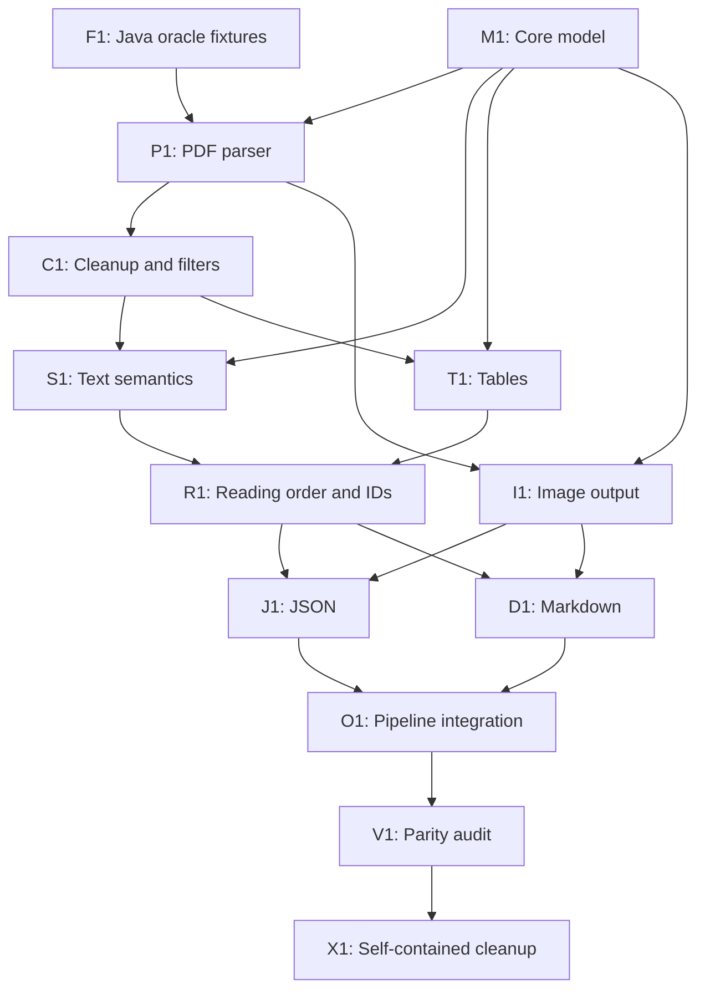

# Local PDF to JSON and Markdown implementation plan

Implement the first Rust version in `crates/opendataloader_core` from
[`docs/specs/pdf-json-markdown-reimplementation.md`](docs/specs/pdf-json-markdown-reimplementation.md).
Treat that specification and the Java implementation as the behavior oracle.
This plan divides the work into agent-sized tasks, records dependencies, and
defines acceptance criteria for each task.

## Work rules

- Assign one unchecked task to one implementation agent. An agent can work only
  after the listed prerequisites are complete.
- Tasks marked **parallel** can run at the same time after their prerequisites
  are complete. Agree on shared Rust data types before parallel work starts.
- Keep implementation and Rust tests in `crates/opendataloader_core`. Do not
  change the CLI, C library, Python package, Java implementation, or the
  specification as part of this plan.
- Every implemented behavior must have a test using a PDF input and expected
  output produced by the original Java implementation. Commit each input,
  oracle output, and manifest needed by the test. Do not generate expected
  values from Rust code.
- Before implementing a behavior, check the F1 manifest for a fixture that
  directly exercises it. If none exists, add the PDF input and Java-generated
  expected output to the corpus and commit them before implementing that
  behavior.
- Store new oracle material under `samples/` and document the Java version,
  command, PDF input, generated files, and covered behavior in a manifest.
  Keep binary images and exact Markdown bytes, including final line feeds.
- Keep the Rust implementation self-contained. Java can generate or verify
  oracle fixtures, but Rust runtime behavior and Rust tests must not invoke
  Java, Maven, Node.js, Python, a network service, or a model.
- Do not implement a task by weakening or deleting a reference comparison.
  If the Java output contradicts the specification, record the discrepancy and
  resolve it before changing the expected output.
- Before editing Rust source, use the codebase-memory MCP graph tools to
  discover the relevant code. The graph currently identifies only the
  `convert` stub in `crates/opendataloader_core/src/lib.rs`; index again if it
  becomes stale.
- Prefer direct, literal translations of the specified Java flow in this
  round. Do not block on idiomatic Rust, performance, or broad refactoring.

## Dependency overview

The first fixture task and internal model are prerequisites for the parser.
After the parser and model stabilize, text cleanup, semantic text grouping,
table reconstruction, and image output can proceed as parallel branches.
Reading order follows semantic reconstruction. JSON and Markdown writers can
then proceed in parallel. The conversion orchestrator and final conformance
pass integrate all branches.

`I1` depends on the stable model and parser but can run alongside `C1`, `S1`,
and `T1`. `J1` and `D1` both consume the ordered model and image references;
they can be implemented in parallel after `R1` and `I1`. `O1` integrates their
finished modules.

## Implementation tasks

- [x] **F1 — Create committed Java oracle fixtures.** **Depends on:** none.
  **Parallel:** no; complete before implementation tasks that assert parity.
  Inspect the committed PDF corpus and the original local Java flow. Reuse
  existing PDFs where they exercise a required behavior. Generate and commit
  Java JSON, Markdown, and external-image outputs for representative cases.
  Add a manifest with source PDF, Java version, exact command, output paths,
  and the behavior each case covers. Include the current `lorem.pdf` reference
  and add cases for multipage/order, raster-only pages, images, tables, lists,
  metadata, and invalid or password-protected input. If the existing corpus
  does not cover a behavior, add a small reproducible PDF fixture and record
  how it was created. Keep fixtures bounded and readable. **Acceptance:** every
  case is generated by the Java implementation; the committed outputs can be
  regenerated with the documented command; the manifest maps every planned
  implementation task to at least one case; `git status` shows all intended
  fixture files tracked and no generated build/decompilation artifacts.

- [x] **M1 — Define the Rust core data model and conversion errors.**
  **Depends on:** none. **Parallel:** before P1; agree the types with all
  branch owners before parallel implementation begins. Add the smallest
  internal representation for a document, metadata, ordered pages, positioned
  parser chunks, semantic elements, IDs, image references, and conversion
  errors required by the specification. Preserve PDF user-space bounds and
  distinguish parser chunks from semantic output nodes. Do not settle the
  public CLI, C ABI, or Python API. **Acceptance:** types represent all
  specified JSON/Markdown element kinds and optional metadata without losing
  page, geometry, text, or image identity; errors distinguish invalid input,
  password, input/output I/O, and document processing; focused tests verify
  model values derived from the committed Java fixture manifest. Implemented
  in `crates/opendataloader_core/src/lib.rs` with focused model and error tests.

- [x] **P1 — Parse local PDFs into document metadata and page chunks.**
  **Depends on:** M1, F1. **Parallel:** no; this is the parser foundation.
  Implement local file opening, PDF signature/parser validation, page count,
  PDF information and XMP metadata fallback, page geometry, and the primitive
  page artifacts required by the spec: text chunks, image chunks, and line-art
  chunks. Keep the source PDF unchanged. Do not add OCR, remote processing, or
  a local model. **Acceptance:** parser tests use committed oracle inputs and
  verify page count, metadata, text, image bounds, and line-art geometry where
  the Java flow exposes them; malformed, non-PDF, and password-protected cases
  produce the specified distinct error categories; raster-only input produces
  no recognized text.

- [x] **C1 — Apply page-local cleanup and default content filters.**
  **Depends on:** P1. **Parallel:** yes, with I1; S1 and T1 may begin once the
  normalized chunk contract is fixed. Implement the specified duplicate,
  decoration, null, tiny, out-of-page, hidden optional-content, background,
  whitespace, spacing, and undefined-character behavior using the Java
  defaults. Keep source geometry and ordering evidence through cleanup.
  **Acceptance:** fixture-backed tests demonstrate each enabled default filter
  and text cleanup behavior; disabled hidden-text detection and
  sanitization do not alter content; repeated conversions produce identical
  normalized chunks. Implemented in `crates/opendataloader_core/src/lib.rs`
  with fixture-backed and focused cleanup tests. The current parser boundary
  does not expose optional-content visibility, image decoration metadata, or
  text coordinates beyond page bounds, so those filters remain no-ops until
  later parser data makes them observable.

- [x] **S1 — Reconstruct text lines, paragraphs, headings, and lists.**
  **Depends on:** M1, C1. **Parallel:** yes, with T1 and I1 after the normalized
  chunk contract is fixed. Implement line grouping, paragraph grouping,
  heading detection and levels, ordered/unordered lists, nested list items,
  and cross-page list joining as described in the spec. Preserve text, font
  data, geometry, and parent/child relationships. **Acceptance:** committed
  Java-generated references exercise each available text semantic; Rust tests
  compare exact node kinds, contents, IDs, page numbers, bounds, nesting, and
  order; unsupported structures are not fabricated. Implemented deterministic
  reconstruction in `reconstruct_semantics`; nested and cross-page list
  joining remain deferred until the parser exposes reliable indentation and
  line geometry.

- [x] **T1 — Reconstruct tables and table cells.** **Depends on:** M1, C1.
  **Parallel:** yes, with S1 and I1 after the normalized chunk contract is
  fixed. Implement the default border-based table path, rows, cells, row and
  column positions, spans, header cells, table text, and cross-page table
  joining. Keep line geometry available to the detector and omit drawing-only
  lines from semantic output. **Acceptance:** border-grid reconstruction tests
  compare row/cell order, dimensions, header cells, text placement, bounds,
  and line-art omission; non-table lines do not become fabricated tables. The
  current parser still assigns page bounds to extracted text and reduces
  `m`/`l` operations to points, so full fixture parity, spans, and parser-
  derived table text remain deferred until those coordinates are exposed.

- [x] **I1 — Extract external image files and assign stable references.**
  **Depends on:** M1, P1. **Parallel:** yes, with C1, S1, and T1 once the image
  element contract is stable. Implement document-local one-based image
  numbering in page and final element order, use an available source image or
  crop its page bounds, write PNG by default and JPEG when selected, and
  produce a consistent relative reference for JSON and Markdown. Isolate a
  single-image write failure from unrelated text and images. Base64 may emit a
  documented placeholder that is not presented as a valid data URI.
  **Acceptance:** committed Java-generated image files and references are
  compared by image count, names, format, bytes or decoded pixels, and
  destinations; no reference points to an unwritten file; image-off writes no
  files; one image failure preserves unrelated extracted content.

- [x] **M2 — Split the Rust core into focused modules and files.** **Depends
  on:** M1, P1, C1, S1, T1, I1. **Parallel:** no; finish before R1 so later
  work builds on the module boundaries. Move the current implementation out of
  the monolithic `crates/opendataloader_core/src/lib.rs` into logically
  separated modules for the data model, PDF parsing, cleanup/geometry,
  semantic reconstruction, and image output. Keep each module self-contained,
  focused on one responsibility, and expose only the narrow interfaces needed
  by other modules. Leave `lib.rs` as module declarations, the crate's public
  exports, and any thin orchestration. Preserve the existing behavior and
  public symbols; do not add features or redesign algorithms in this refactor.
  **Acceptance:** all existing `opendataloader_core` tests pass unchanged;
  Java-generated fixture comparisons remain byte/structure equivalent; each
  major implementation responsibility lives in its own Rust module/file; no
  module becomes a new catch-all; the crate builds without requiring Java
  sources or changing downstream call sites.

- [x] **R1 — Apply deterministic page reading order and IDs.** **Depends on:**
  S1, T1. **Parallel:** no; runs after semantic reconstruction. Implement the
  default XY-Cut++ reading order and `off` parser order, retaining page order
  and assigning stable nonzero IDs at the specified stage. Ensure JSON and
  Markdown consume the same ordered content. **Acceptance:** multi-column,
  multi-page, and parser-order references match the Java sequence; IDs and
  page numbers are deterministic across repeated runs; page selection does not
  change the source document page count.
  Implemented in `crates/opendataloader_core/src/reading_order.rs` with
  deterministic default geometry ordering, explicit parser-order mode, and
  recursive nonzero IDs. Full XY-Cut++ parity remains deferred because the
  current parser does not preserve reliable per-chunk coordinates.

- [x] **M3 — Colocate Rust unit tests with the code they test.** **Depends
  on:** M2, R1. **Parallel:** no; finish before serializer implementation so
  new unit tests follow the same layout. Move each existing Rust unit test into
  the source file and module containing the function or type it tests. Keep
  tests close to their implementation, such as in an inline `#[cfg(test)]`
  module in that file; do not collect these unit tests in a centralized test
  module. Preserve test behavior and coverage. **Acceptance:** every Rust unit
  test is colocated with its tested function or type; no centralized unit-test
  module remains for these tests; all `opendataloader_core` tests pass.
  Implemented by moving the centralized tests into `model`, `parser`,
  `cleanup`, `semantics`, and `images` inline test modules; `lib.rs` now has
  no centralized unit-test module.

- [x] **J1 — Serialize the specified JSON document and elements.**
  **Depends on:** R1, I1. **Parallel:** yes, with D1. Implement the exact root
  keys, metadata nulls, property names, type strings, common fields,
  kind-specific fields, child arrays, omission rules, and external image
  references from the spec. Preserve numeric values and distinguish null,
  omitted, and empty fields as the Java serializers do. **Acceptance:** compare
  JSON structurally to committed Java references, ignoring object-key order
  only; compare arrays, values, nulls, and omitted fields exactly; verify the
  `lorem.json` baseline and image-bearing output. Implemented in
  `crates/opendataloader_core/src/json.rs` with serde_json-backed root,
  common-field, text, image, list, table, formula, caption, and TOC serializers;
  focused tests cover mandatory metadata nulls, rounded geometry, image
  references, and nested table rows/cells.

- [x] **D1 — Render the specified Markdown document.** **Depends on:** R1, I1.
  **Parallel:** yes, with J1. Implement heading levels, paragraphs/text,
  recursive lists, pipe tables, formulas, images, text escaping, table-cell
  line-break behavior, destination sanitization, and exact two-LF separators.
  Do not add inferred title or page headings. **Acceptance:** compare exact
  UTF-8 bytes against committed Java references, including final line feeds;
  verify images use the same destination as JSON and HTML-in-Markdown behavior
  is included only if the selected core implementation supports that specified
  mode. Implemented in `crates/opendataloader_core/src/markdown.rs` with
  focused tests for headings, text escaping, formulas, lists, tables, images,
  destination sanitization, and exact two-LF separators. Full fixture parity
  and HTML-in-Markdown mode remain deferred until the conversion orchestrator
  and parser expose the required output configuration.

- [ ] **O1 — Connect the local conversion pipeline.** **Depends on:** P1, C1,
  S1, T1, I1, R1, J1, D1. **Parallel:** no. Replace the `convert` stub in
  `crates/opendataloader_core/src/lib.rs` with a single extraction pass that
  can write JSON, Markdown, and image files from the same extracted document.
  Keep the existing crate boundary; do not define or change CLI, C ABI, or
  Python contracts. Return failures rather than reporting success with
  fabricated empty output. **Acceptance:** `cargo test -p opendataloader_core`
  passes; an end-to-end test converts committed PDFs and compares requested
  files to Java references; requesting both formats parses each PDF once and
  shares IDs, page order, and image numbering; source PDFs remain unchanged.

- [ ] **V1 — Close the first-round parity and traceability gaps.** **Depends
  on:** O1. **Parallel:** no. Walk the specification's first-round conformance
  checklist and map every required behavior to a Rust implementation location
  and a committed oracle fixture. Add missing Java-generated fixture cases
  before claiming parity. Record known discrepancies with the Java output in
  the manifest instead of silently weakening tests. **Acceptance:** each
  in-scope checklist item has a named Rust module/function and a passing
  fixture-backed test, or a concrete documented blocker; `cargo test -p
  opendataloader_core` passes; no test requires Java or network access.

- [ ] **X1 — Make the completed Rust path self-contained and traceable.**
  **Depends on:** V1. **Parallel:** no. Remove accidental runtime, build, or
  test dependencies on Java sources and generated decompilation output.
  Preserve the behavior needed to understand and maintain the Rust path in
  `docs/specs/`, fixture manifests, and concise Rust module documentation:
  link each pipeline stage to the relevant spec section and keep oracle
  provenance with the committed data. Do not remove Java reference material in
  this task. **Acceptance:** the Rust implementation and tests build and run
  after Java source directories are unavailable; every major stage is
  traceable to the spec and a fixture; `git grep` finds no required runtime
  Java-source path or generated `target/` artifact; all new fixtures and docs
  are committed.

## Out of scope for this round; planned for later

Do not implement these items while completing the unchecked tasks above.

- Refactor the direct Java-to-Rust mapping into idiomatic, layered Rust or
  remove object-oriented shapes that were retained for one-to-one parity.
- Remove or reduce unsafe code after the initial behavior is correct.
- Make conversion state thread-safe or add multi-worker page processing.
- Improve throughput, memory use, allocations, or image-processing
  performance.
- Add the Python package or Python bindings.
- Add or complete the CLI contract and command-line behavior.
- Add or complete the C ABI and its public API contract.
- Add hybrid or remote processing, OCR, ML models, PDF/A validation,
  linearization-specific behavior, or other deferred formats and features.
