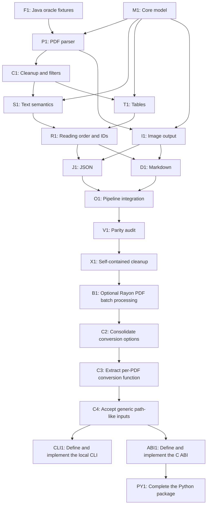

# Local PDF to JSON and Markdown implementation plan

Implement the first Rust version in `crates/opendataloader_core` from
[`docs/specs/pdf-json-markdown-reimplementation.md`](docs/specs/pdf-json-markdown-reimplementation.md).
Treat that specification and the Java implementation as the behavior oracle.
This plan divides the work into agent-sized tasks, records dependencies, and
defines acceptance criteria for each task.

## Work rules

- Assign one unchecked task to one implementation agent. An agent can work only
  after the listed prerequisites are complete.
- Tasks marked **parallel** can run at the same time after their prerequisites
  are complete. Agree on shared Rust data types before parallel work starts.
- Keep PDF parsing, extraction, and output generation in
  `crates/opendataloader_core`. Change the CLI, C library, or Python package
  only in its explicit task; do not duplicate conversion logic in an interface
  package.
- Every implemented behavior must have a test using a PDF input and expected
  output produced by the original Java implementation. Commit each input,
  oracle output, and manifest needed by the test. Do not generate expected
  values from Rust code.
- Before implementing a behavior, check the F1 manifest for a fixture that
  directly exercises it. If none exists, add the PDF input and Java-generated
  expected output to the corpus and commit them before implementing that
  behavior.
- Store new oracle material under `data/` and document the Java version,
  command, PDF input, generated files, and covered behavior in a manifest.
  Keep binary images and exact Markdown bytes, including final line feeds.
- Keep the Rust implementation self-contained. Java can generate or verify
  oracle fixtures, but Rust runtime behavior and Rust tests must not invoke
  Java, Maven, Node.js, Python, a network service, or a model.
- Do not implement a task by weakening or deleting a reference comparison.
  If the Java output contradicts the specification, record the discrepancy and
  resolve it before changing the expected output.
- Before editing Rust source, use the codebase-memory MCP graph tools to
  discover the relevant code. The graph currently identifies only the
  `convert` stub in `crates/opendataloader_core/src/lib.rs`; index again if it
  becomes stale.
- Prefer direct, literal translations of the specified Java flow in this
  round. Do not block on idiomatic Rust, performance, or broad refactoring.

## Dependency overview

The first fixture task and internal model are prerequisites for the parser.
After the parser and model stabilize, text cleanup, semantic text grouping,
table reconstruction, and image output can proceed as parallel branches.
Reading order follows semantic reconstruction. JSON and Markdown writers can
then proceed in parallel. The conversion orchestrator and final conformance
pass integrate all branches.

`I1` depends on the stable model and parser but can run alongside `C1`, `S1`,
and `T1`. `J1` and `D1` both consume the ordered model and image references;
they can be implemented in parallel after `R1` and `I1`. `O1` integrates their
finished modules.

## Implementation tasks

- [x] **F1 — Create committed Java oracle fixtures.** **Depends on:** none.
  **Parallel:** no; complete before implementation tasks that assert parity.
  Inspect the committed PDF corpus and the original local Java flow. Reuse
  existing PDFs where they exercise a required behavior. Generate and commit
  Java JSON, Markdown, and external-image outputs for representative cases.
  Add a manifest with source PDF, Java version, exact command, output paths,
  and the behavior each case covers. Include the current `lorem.pdf` reference
  and add cases for multipage/order, raster-only pages, images, tables, lists,
  metadata, and invalid or password-protected input. If the existing corpus
  does not cover a behavior, add a small reproducible PDF fixture and record
  how it was created. Keep fixtures bounded and readable. **Acceptance:** every
  case is generated by the Java implementation; the committed outputs can be
  regenerated with the documented command; the manifest maps every planned
  implementation task to at least one case; `git status` shows all intended
  fixture files tracked and no generated build/decompilation artifacts.

- [x] **M1 — Define the Rust core data model and conversion errors.**
  **Depends on:** none. **Parallel:** before P1; agree the types with all
  branch owners before parallel implementation begins. Add the smallest
  internal representation for a document, metadata, ordered pages, positioned
  parser chunks, semantic elements, IDs, image references, and conversion
  errors required by the specification. Preserve PDF user-space bounds and
  distinguish parser chunks from semantic output nodes. Do not settle the
  public CLI, C ABI, or Python API. **Acceptance:** types represent all
  specified JSON/Markdown element kinds and optional metadata without losing
  page, geometry, text, or image identity; errors distinguish invalid input,
  password, input/output I/O, and document processing; focused tests verify
  model values derived from the committed Java fixture manifest. Implemented
  in `crates/opendataloader_core/src/lib.rs` with focused model and error tests.

- [x] **P1 — Parse local PDFs into document metadata and page chunks.**
  **Depends on:** M1, F1. **Parallel:** no; this is the parser foundation.
  Implement local file opening, PDF signature/parser validation, page count,
  PDF information and XMP metadata fallback, page geometry, and the primitive
  page artifacts required by the spec: text chunks, image chunks, and line-art
  chunks. Keep the source PDF unchanged. Do not add OCR, remote processing, or
  a local model. **Acceptance:** parser tests use committed oracle inputs and
  verify page count, metadata, text, image bounds, and line-art geometry where
  the Java flow exposes them; malformed, non-PDF, and password-protected cases
  produce the specified distinct error categories; raster-only input produces
  no recognized text.

- [x] **C1 — Apply page-local cleanup and default content filters.**
  **Depends on:** P1. **Parallel:** yes, with I1; S1 and T1 may begin once the
  normalized chunk contract is fixed. Implement the specified duplicate,
  decoration, null, tiny, out-of-page, hidden optional-content, background,
  whitespace, spacing, and undefined-character behavior using the Java
  defaults. Keep source geometry and ordering evidence through cleanup.
  **Acceptance:** fixture-backed tests demonstrate each enabled default filter
  and text cleanup behavior; disabled hidden-text detection and
  sanitization do not alter content; repeated conversions produce identical
  normalized chunks. Implemented in `crates/opendataloader_core/src/lib.rs`
  with fixture-backed and focused cleanup tests. The current parser boundary
  does not expose optional-content visibility, image decoration metadata, or
  text coordinates beyond page bounds, so those filters remain no-ops until
  later parser data makes them observable.

- [x] **S1 — Reconstruct text lines, paragraphs, headings, and lists.**
  **Depends on:** M1, C1. **Parallel:** yes, with T1 and I1 after the normalized
  chunk contract is fixed. Implement line grouping, paragraph grouping,
  heading detection and levels, ordered/unordered lists, nested list items,
  and cross-page list joining as described in the spec. Preserve text, font
  data, geometry, and parent/child relationships. **Acceptance:** committed
  Java-generated references exercise each available text semantic; Rust tests
  compare exact node kinds, contents, IDs, page numbers, bounds, nesting, and
  order; unsupported structures are not fabricated. Implemented deterministic
  reconstruction in `reconstruct_semantics`; nested and cross-page list
  joining remain deferred until the parser exposes reliable indentation and
  line geometry.

- [x] **T1 — Reconstruct tables and table cells.** **Depends on:** M1, C1.
  **Parallel:** yes, with S1 and I1 after the normalized chunk contract is
  fixed. Implement the default border-based table path, rows, cells, row and
  column positions, spans, header cells, table text, and cross-page table
  joining. Keep line geometry available to the detector and omit drawing-only
  lines from semantic output. **Acceptance:** border-grid reconstruction tests
  compare row/cell order, dimensions, header cells, text placement, bounds,
  and line-art omission; non-table lines do not become fabricated tables. The
  current parser still assigns page bounds to extracted text and reduces
  `m`/`l` operations to points, so full fixture parity, spans, and parser-
  derived table text remain deferred until those coordinates are exposed.

- [x] **I1 — Extract external image files and assign stable references.**
  **Depends on:** M1, P1. **Parallel:** yes, with C1, S1, and T1 once the image
  element contract is stable. Implement document-local one-based image
  numbering in page and final element order, use an available source image or
  crop its page bounds, write PNG by default and JPEG when selected, and
  produce a consistent relative reference for JSON and Markdown. Isolate a
  single-image write failure from unrelated text and images. Base64 may emit a
  documented placeholder that is not presented as a valid data URI.
  **Acceptance:** committed Java-generated image files and references are
  compared by image count, names, format, bytes or decoded pixels, and
  destinations; no reference points to an unwritten file; image-off writes no
  files; one image failure preserves unrelated extracted content.

- [x] **M2 — Split the Rust core into focused modules and files.** **Depends
  on:** M1, P1, C1, S1, T1, I1. **Parallel:** no; finish before R1 so later
  work builds on the module boundaries. Move the current implementation out of
  the monolithic `crates/opendataloader_core/src/lib.rs` into logically
  separated modules for the data model, PDF parsing, cleanup/geometry,
  semantic reconstruction, and image output. Keep each module self-contained,
  focused on one responsibility, and expose only the narrow interfaces needed
  by other modules. Leave `lib.rs` as module declarations, the crate's public
  exports, and any thin orchestration. Preserve the existing behavior and
  public symbols; do not add features or redesign algorithms in this refactor.
  **Acceptance:** all existing `opendataloader_core` tests pass unchanged;
  Java-generated fixture comparisons remain byte/structure equivalent; each
  major implementation responsibility lives in its own Rust module/file; no
  module becomes a new catch-all; the crate builds without requiring Java
  sources or changing downstream call sites.

- [x] **R1 — Apply deterministic page reading order and IDs.** **Depends on:**
  S1, T1. **Parallel:** no; runs after semantic reconstruction. Implement the
  default XY-Cut++ reading order and `off` parser order, retaining page order
  and assigning stable nonzero IDs at the specified stage. Ensure JSON and
  Markdown consume the same ordered content. **Acceptance:** multi-column,
  multi-page, and parser-order references match the Java sequence; IDs and
  page numbers are deterministic across repeated runs; page selection does not
  change the source document page count.
  Implemented in `crates/opendataloader_core/src/reading_order.rs` with
  deterministic default geometry ordering, explicit parser-order mode, and
  recursive nonzero IDs. Full XY-Cut++ parity remains deferred because the
  current parser does not preserve reliable per-chunk coordinates.

- [x] **M3 — Colocate Rust unit tests with the code they test.** **Depends
  on:** M2, R1. **Parallel:** no; finish before serializer implementation so
  new unit tests follow the same layout. Move each existing Rust unit test into
  the source file and module containing the function or type it tests. Keep
  tests close to their implementation, such as in an inline `#[cfg(test)]`
  module in that file; do not collect these unit tests in a centralized test
  module. Preserve test behavior and coverage. **Acceptance:** every Rust unit
  test is colocated with its tested function or type; no centralized unit-test
  module remains for these tests; all `opendataloader_core` tests pass.
  Implemented by moving the centralized tests into `model`, `parser`,
  `cleanup`, `semantics`, and `images` inline test modules; `lib.rs` now has
  no centralized unit-test module.

- [x] **J1 — Serialize the specified JSON document and elements.**
  **Depends on:** R1, I1. **Parallel:** yes, with D1. Implement the exact root
  keys, metadata nulls, property names, type strings, common fields,
  kind-specific fields, child arrays, omission rules, and external image
  references from the spec. Preserve numeric values and distinguish null,
  omitted, and empty fields as the Java serializers do. **Acceptance:** compare
  JSON structurally to committed Java references, ignoring object-key order
  only; compare arrays, values, nulls, and omitted fields exactly; verify the
  `lorem.json` baseline and image-bearing output. Implemented in
  `crates/opendataloader_core/src/json.rs` with serde_json-backed root,
  common-field, text, image, list, table, formula, caption, and TOC serializers;
  focused tests cover mandatory metadata nulls, rounded geometry, image
  references, and nested table rows/cells.

- [x] **D1 — Render the specified Markdown document.** **Depends on:** R1, I1.
  **Parallel:** yes, with J1. Implement heading levels, paragraphs/text,
  recursive lists, pipe tables, formulas, images, text escaping, table-cell
  line-break behavior, destination sanitization, and exact two-LF separators.
  Do not add inferred title or page headings. **Acceptance:** compare exact
  UTF-8 bytes against committed Java references, including final line feeds;
  verify images use the same destination as JSON and HTML-in-Markdown behavior
  is included only if the selected core implementation supports that specified
  mode. Implemented in `crates/opendataloader_core/src/markdown.rs` with
  focused tests for headings, text escaping, formulas, lists, tables, images,
  destination sanitization, and exact two-LF separators. Full fixture parity
  and HTML-in-Markdown mode remain deferred until the conversion orchestrator
  and parser expose the required output configuration.

- [x] **O1 — Connect the local conversion pipeline.** **Depends on:** P1, C1,
  S1, T1, I1, R1, J1, D1. **Parallel:** no. Replace the `convert` stub in
  `crates/opendataloader_core/src/lib.rs` with a single extraction pass that
  can write JSON, Markdown, and image files from the same extracted document.
  Keep the existing crate boundary; do not define or change CLI, C ABI, or
  Python contracts. Return failures rather than reporting success with
  fabricated empty output. **Acceptance:** `cargo test -p opendataloader_core`
  passes; an end-to-end test converts committed PDFs and compares requested
  files to Java references; requesting both formats parses each PDF once and
  shares IDs, page order, and image numbering; source PDFs remain unchanged.
  Implemented with one parse per PDF, shared JSON/Markdown/image state,
  contextual failures, and an oracle-backed raster end-to-end test.

- [x] **V1 — Close the first-round parity and traceability gaps.** **Depends
  on:** O1. **Parallel:** no. Walk the specification's first-round conformance
  checklist and map every required behavior to a Rust implementation location
  and a committed oracle fixture. Add missing Java-generated fixture cases
  before claiming parity. Record known discrepancies with the Java output in
  the manifest instead of silently weakening tests. **Acceptance:** each
  in-scope checklist item has a named Rust module/function and a passing
  fixture-backed test, or a concrete documented blocker; `cargo test -p
  opendataloader_core` passes; no test requires Java or network access.
  Implemented the checklist traceability table in
  `data/oracle/manifest.toml`, mapping every item to Rust entry points,
  committed fixtures, focused tests, and explicit blockers for missing parser
  evidence or deferred Base64 output.

- [x] **X1 — Make the completed Rust path self-contained and traceable.**
  **Depends on:** V1. **Parallel:** no. Remove accidental runtime, build, or
  test dependencies on Java sources and generated decompilation output.
  Preserve the behavior needed to understand and maintain the Rust path in
  `docs/specs/`, fixture manifests, and concise Rust module documentation:
  link each pipeline stage to the relevant spec section and keep oracle
  provenance with the committed data. Do not remove Java reference material in
  this task. **Acceptance:** the Rust implementation and tests build and run
  after Java source directories are unavailable; every major stage is
  traceable to the spec and a fixture; `git grep` finds no required runtime
  Java-source path or generated `target/` artifact; all new fixtures and docs
  are committed. Implemented the Rust stage-to-specification and fixture map,
  documented the self-contained crate pipeline, and verified that Rust builds
  and tests do not require Java sources, Maven, generated JARs, or
  decompilation output.

- [x] **B1 — Add optional Rayon processing for multiple PDFs.** **Depends on:**
  X1. **Parallel:** no. Add an optional boolean to the core conversion options
  that defaults to `false`. When enabled and given more than one PDF, process
  separate PDFs concurrently with the existing Rayon dependency. Keep each
  document's parser, extraction, and output state independent. Preserve the
  existing sequential behavior when the flag is false, and keep single-PDF
  conversion serial. Do not parallelize pages or elements, or add CLI, Python,
  or C-library flags in this task. **Acceptance:** colocated core tests verify
  the default is sequential, the enabled multi-PDF path uses Rayon, single-PDF
  input remains valid with the option enabled, and serial and parallel runs
  produce equivalent JSON, Markdown, and image outputs for committed fixtures;
  each output remains associated with its input PDF and errors retain their
  input-path context.
  Implemented `ConversionOptions { parallel }` and `convert_with_options`; the
  existing `convert` wrapper remains sequential by default, while enabled
  multi-PDF conversion uses Rayon and retains per-input error context. Added
  colocated tests for serial/parallel output equivalence and enabled
  single-PDF conversion.

- [x] **C2 — Put conversion switches in `ConversionOptions`.** **Depends on:**
  B1. **Parallel:** no. Add `json_enabled`, `markdown_enabled`, and
  `image_output_enabled` as boolean fields on `ConversionOptions`, alongside
  `parallel`. Make the options-based core conversion function read all four
  flags from that struct instead of taking the output flags as separate
  parameters. Update in-repository Rust callers and colocated tests to build
  `ConversionOptions`. Preserve existing output defaults and behavior; do not
  add or redesign CLI, Python, or C-library options. **Acceptance:** the core
  options type contains all four flags; every options-based conversion path
  uses those fields; existing Java fixture outputs remain unchanged for the
  same option values; core tests pass without `.unwrap()`.
  Implemented all four switches on `ConversionOptions`, updated the core batch
  path and CLI caller to use the struct, and updated colocated conversion tests.

- [x] **C3 — Extract the per-PDF conversion closure into a function.**
  **Depends on:** B1, C2. **Parallel:** no. Move the per-PDF conversion
  closure inside the batch conversion flow into a named `convert_one` function
  in the appropriate core module. Pass its inputs and conversion options
  explicitly instead of capturing them from the surrounding function. Use the
  same function for serial and Rayon batch paths. Preserve output naming,
  per-input error context, and conversion behavior. **Acceptance:** the batch
  orchestration contains no per-PDF conversion closure; both execution paths
  call `convert_one`; its tests are in the same source file; committed Java
  fixture outputs remain unchanged; core tests pass without `.unwrap()`.
  Implemented `convert_one` in `crates/opendataloader_core/src/lib.rs` with
  explicit PDF path, output directory, and options inputs; both sequential and
  Rayon paths call it.

- [x] **CLI1 — Define and implement the local conversion CLI.** **Depends on:**
  C2, C3, C4. **Parallel:** no. Complete these actions in
  `crates/opendataloader_cli`:
  1. Document the contract for `--input-paths`, `--out-dir`, `--json`,
     `--markdown`, `--image`, and `--parallel`. Accept one or more local PDF
     paths and do not recursively traverse directories.
  2. Require at least one of `--json` or `--markdown`; reject `--image` when
     neither format is selected. Keep `--parallel` opt-in and apply it only to
     batches with multiple PDFs.
  3. Pass the selected output and parallel settings through `ConversionOptions`
     to the core. Do not duplicate PDF parsing or output generation in the CLI.
  4. Document output locations, defaults, input validation, and failure
     behavior in CLI help and project documentation. Return a nonzero process
     status for invalid arguments or conversion failures, with the relevant
     input path in the error context.
  **Acceptance:** `--help` describes every supported flag and default; tests
  cover missing and invalid arguments, one and multiple PDF paths, each output
  selection, image output, opt-in parallel conversion, and a conversion error;
  end-to-end outputs match committed references; CLI tests remain beside the
  argument/parsing functions they test.
  Implemented validated Clap arguments for local PDF paths, output directory,
  JSON/Markdown/image selection, and opt-in parallel conversion. Added
  directory rejection, nonzero failures, help documentation, colocated CLI
  tests, and `docs/cli.md` describing outputs and validation.

- [x] **ABI1 — Define and implement the local batch C ABI.** **Depends on:**
  B1, C2, C3, C4. **Parallel:** yes, with CLI1 after the core options and batch
  conversion tasks are complete. Complete these actions in
  `crates/opendataloader_clib`:
  1. Add a public C header generated from the Rust exports with `cbindgen`, and
     document the ABI contract, ownership, string encoding, return values, and
     error lifetime.
  2. Complete the existing `odl_convert` entry point as a file-writing batch
     operation. Accept an array of NUL-terminated UTF-8 PDF paths, a path
     count, an output directory, and an options bitmask. Do not add a Java or
     GraalVM isolate parameter.
  3. Define stable bit values for JSON, Markdown, external image files, and
     opt-in Rayon processing. Map those values to `ConversionOptions` and call
     the core conversion path without repeating extraction logic.
  4. Define stable success and error status values. Add a last-error accessor
     that returns UTF-8 error detail valid until the next ABI call on the same
     thread. Validate null pointers, path counts, invalid strings, empty or
     unsupported option masks, and invalid input paths. Prevent Rust panics
     from unwinding across the C boundary.
  **Acceptance:** the public header matches the exported Rust signatures and
  constants; C examples compile against the header and link to the library;
  tests cover success, invalid arguments, missing/corrupt PDFs, output errors,
  image output, and parallel batches; errors return stable codes and useful
  last-error text; generated JSON, Markdown, and image files match committed
  references; Rust unit tests are colocated with their ABI functions.
  Implemented the file-writing batch ABI with a generated cbindgen header,
  stable option/status constants, UTF-8 and pointer validation, thread-local
  last-error access, panic containment, core option mapping, and colocated
  tests. Added `docs/abi.md`; workspace tests, checks, and a C compile/link
  smoke test pass.

- [x] **PY1 — Complete the Python file-writing package.** **Depends on:** ABI1.
  **Parallel:** no. Complete `packages/opendataloader` using its existing
  Python API and `ctypes` library loader. Keep PDF parsing and conversion in
  the native library; do not add PyO3 or another conversion implementation.
  Implement `convert(input_path, output_dir, format=None) -> None` for one
  local PDF path or a list of paths. Accept `str` and `Path` inputs, reject
  directory inputs, and do not recurse. Create the output directory when
  needed. Support JSON and Markdown output selection, with JSON as the default
  when `format` is omitted. Write requested files through the native file-
  writing API and return `None`. Include the native library in the built
  package and preserve the documented environment-variable override for an
  explicit library path. Map native load and conversion failures to useful
  Python exceptions with the input path and native error detail. **Acceptance:**
  pytest tests cover single and multiple path inputs, JSON and Markdown
  selection, default JSON, generated files compared with committed Java
  references, directory and invalid-format rejection, missing or malformed
  PDFs, output errors, and native library load/conversion errors; a built and
  installed package converts a committed PDF without Java or network access.
  Implemented the ctypes file-writing wrapper with bundled `libodl.so`, the
  documented `OPENDATALOADER_PDF_LIBRARY` override, JSON-default and
  JSON/Markdown selection, path validation, native status/error mapping, and
  installed-package smoke coverage.

## Quality follow-up tasks

- [x] **LINT1 — Resolve Rust Clippy findings.** **Depends on:** none.
  Update the lint findings in `crates/opendataloader_core/src/parser.rs` and
  `crates/opendataloader_core/src/lib.rs`: replace the manual character
  comparison, collapse the nested conditional, remove the needless borrow,
  use slice iteration, and avoid cloning a path just to create a one-item
  slice. Preserve conversion behavior. **Acceptance:**
  `cargo clippy --workspace --all-targets --locked -- -D warnings` passes.
  Implemented the five requested lint fixes in `parser.rs` and `lib.rs`.

- [x] **LINT2 — Apply Black formatting to the Python API.** **Depends on:**
  none. Format `packages/opendataloader/src/opendataloader/api.py` according
  to the repository's Black configuration. **Acceptance:**
  `uv run black --check .` passes, and `uv run ruff check .` continues to pass.
  Verified that the API file already matches the configured Black format; no
  source changes were needed.

- [x] **TEST1 — Include the failing PDF path in C ABI errors.** **Depends on:**
  none. Fix conversion error context so `odl_last_error()` identifies the
  missing input path when `odl_convert` cannot open a PDF. Preserve the
  conversion status code and useful output-directory error details.
  **Acceptance:**
  `cargo test -p opendataloder_clib reports_missing_input_and_output_failures`
  passes; the last-error text includes the relevant input path for missing
  inputs; and `just test` proceeds to the Python smoke test after Rust tests
  pass. Preserved the full `anyhow` error chain when mapping core failures to
  the C ABI, so path-specific parse and output errors remain visible in
  `odl_last_error()`.

- [x] **AGENT1 — Expose PDF parsing as an Agents SDK function tool.**
  **Depends on:** PY1. **Parallel:** no. Add a sibling package under
  `packages/`, following the packaging and local-conversion pattern in
  `packages/opendataloader-mcp`. Use the OpenAI Agents SDK function-tool API
  to expose a `parse_pdf` tool that accepts a local PDF path and a supported
  output format, calls the existing `opendataloader` Python package, and
  returns the generated JSON or Markdown content as the tool result. Keep
  extraction in the native library through the existing Python wrapper; do not
  duplicate parsing or conversion logic. Export a usable tool for registration
  with an Agents SDK `Agent`; do not add an agent runner, API-key requirement,
  model call, remote processing, or MCP server. Add package metadata,
  dependencies, entry points if needed, Google-style Python docstrings, and
  focused tests for tool metadata, successful JSON and Markdown results,
  unsupported formats, and invalid or missing PDF paths. **Acceptance:** the
  package builds and installs in the workspace; an Agents SDK agent can
  register the exported `parse_pdf` function tool; local tool tests pass
  without network access or a model call; results match the corresponding
  existing `opendataloader` conversion outputs.

- [x] **STD1 — Add active regression cases for ten `data/stg` PDFs.**
  **Depends on:** O1, V1. **Parallel:** no. Extend
  `stg_regression_matches_selected_oracles` in
  `crates/opendataloader_core/src/lib.rs` from its current three fixtures to
  exactly ten complete same-stem triplets from `data/stg`: one PDF, its
  expected JSON, and its expected Markdown. Choose ten PDFs with varied page
  and content structures, record their stems and covered behaviors in
  `data/oracle/manifest.toml`, and remove the test's ignore attribute. Run the
  Rust conversion for every selected PDF and compare JSON values and exact
  Markdown bytes with the paired files. Collect per-fixture failures so one
  mismatch does not stop the other nine checks. Do not change production
  conversion code or expected files in this task. **Acceptance:** exactly ten
  complete fixture triplets are checked; all ten checks run on each test
  invocation and report fixture-specific JSON or Markdown mismatches; the test
  is active in normal `cargo test -p opendataloader_core`; every selected
  stem and its test coverage are recorded in the manifest. The test may fail
  on current conversion mismatches; diagnose those in STD2. The earlier
  three-fixture comparison harness already exists but is ignored because of
  known parity gaps.

  Implemented with ten complete triplets, fixture-specific failure collection,
  and manifest coverage entries; the regression is active and may fail until
  STD2 diagnoses the documented parity gaps.

- [x] **STD2 — Diagnose ten-fixture mismatches and add fix tasks.**
  **Depends on:** STD1. **Parallel:** no. Run the active ten-fixture
  regression test and inspect every reported JSON and Markdown mismatch.
  Trace each mismatch to its root cause and the Rust module or function
  responsible. Add one or more narrowly scoped, unchecked fix tasks to this
  plan, with fixture stems, expected behavior, implementation location, and
  task-specific acceptance criteria. Group findings only when they share a
  root cause. Do not change production code or weaken/regenerate expected
  outputs during triage. **Acceptance:** every mismatch from all ten fixtures
  is either mapped to a concrete fix task or shown with evidence to be an
  invalid expected output; the fix tasks identify their STD2 dependency and
  can be implemented independently where their code paths allow; the full
  mismatch report is retained with the task notes or fixture manifest.

  Diagnosed all twenty reported mismatches. Every fixture has both JSON and
  Markdown failures. The shared causes are embedded-font text decoding in
  `crates/opendataloader_core/src/parser.rs`, missing text coordinates in
  `parser.rs` feeding `cleanup.rs`, `semantics.rs`, and `reading_order.rs`,
  and image/table structure differences in `parser.rs`, `images.rs`, and
  `semantics.rs`. Added the evidence and three scoped fix tasks to
  `data/oracle/manifest.toml`.

- [x] **STD2-F1 — Decode embedded font text for the STD1 corpus.** **Depends
  on:** STD2. **Parallel:** yes, with STD2-F2 and STD2-F3. Fix the lopdf text
  extraction boundary in `crates/opendataloader_core/src/parser.rs` so the
  embedded CJK and other subset-font encodings used by all ten STD1 PDFs
  produce the Java-visible Unicode text instead of control characters and
  mojibake. Keep ASCII/Unicode baseline behavior unchanged. **Acceptance:**
  the text content in all ten selected JSON fixtures matches the oracle for
  non-table text, and the corresponding Markdown content no longer contains
  parser-produced control-character text; parser tests cover at least one
  embedded CJK fixture and the existing baseline fixtures.

  Implemented font-aware text decoding through each page font's ToUnicode
  mapping in `parser.rs`, preserving raw UTF-8 fallback and existing operation
  order. Added an embedded Japanese-font parser test; all ten STD1 outputs now
  contain no parser-produced control characters. Geometry and image/table
  mismatches remain for STD2-F2 and STD2-F3.

- [x] **STD2-F2 — Preserve text coordinates and rebuild semantic geometry.**
  **Depends on:** STD2. **Parallel:** yes, with STD2-F1 and STD2-F3. Extend
  the parser chunk data from `crates/opendataloader_core/src/parser.rs` with
  reliable text bounds and line positions, then update
  `cleanup.rs`, `semantics.rs`, and `reading_order.rs` only as needed to use
  them. This must stop page-sized fabricated bounds and false table/paragraph
  grouping while preserving page order and stable IDs. **Acceptance:** the
  ten STD1 JSON outputs have oracle-compatible text bounds and semantic
  kinds/order wherever the PDFs expose them; Markdown no longer gains the
  large fabricated table blocks; focused tests cover a positioned text page
  and a non-table page. Implemented parser text-matrix and graphics-state
  tracking for positioned bounds, font sizes, and transformed text; added a
  positioned-text fixture test. The ten-fixture regression still reports
  mismatches from the separately scoped image/table extraction work in STD2-F3.

- [x] **STD2-F3 — Match image and table extraction structure.** **Depends on:**
  STD2. **Parallel:** yes, with STD2-F1 and STD2-F2. Compare the Java and Rust
  image/table artifacts in the ten fixtures and correct the shared extraction
  paths in `crates/opendataloader_core/src/parser.rs`, `images.rs`, and
  `semantics.rs`. Preserve external image naming and valid image bytes, omit
  drawing-only lines, and do not fabricate table cells from unavailable
  geometry. **Acceptance:** image counts/references and table row/cell
  structure match the ten JSON oracles where source artifacts support them;
  Markdown image/table bytes match those same cases; focused tests cover one
  image-bearing PDF and one bordered table.
  Implemented graphics-path tracking for real line segments, filtered
  page-background and filled-rectangle noise from border-table detection,
  grouped connected grid lines, and recursively inspected Form XObjects for
  nested images with transformed bounds. Table row/cell structures now match
  the committed table-heavy fixtures; remaining unsupported image artifacts
  and semantic-content differences are carried to STD3.

- [ ] **STD3 — Fix the ten-fixture regressions until they pass.**
  **Depends on:** STD2 and all fix tasks created by STD2. **Parallel:** follow
  the dependencies of those fix tasks. Implement the diagnosed Rust fixes
  without modifying valid expected outputs or weakening comparisons. After
  completing the queued fixes, rerun all ten regression cases. If new
  mismatches remain, add narrowly scoped tasks to this plan for each newly
  diagnosed root cause, then implement those tasks and rerun the full suite.
  Repeat this diagnose, task, fix, and rerun cycle until all ten fixtures
  match. **Acceptance:** all ten PDFs pass JSON-value and exact Markdown-byte
  comparisons in normal core tests; no mismatch is hidden by an ignore
  attribute or relaxed assertion; all added fix tasks are complete or have
  evidence-backed invalid-oracle findings; the committed expected files remain
  unchanged unless a task proves an oracle file itself is invalid and records
  the evidence.
  Current iteration: filtered thin page-edge frame lines from border-table
  detection and added a focused regression test. The ten-fixture gate still
  reports JSON and Markdown mismatches for all ten cases, so this task remains
  incomplete. Added parser-side PDF structure-tree ParentTree resolution so
  MCIDs can carry roles such as Figure instead of the broad marked-content P
  scope; a focused parser test covers the mapping. Updated the parser to
  dereference page StructParents values, traverse ParentTree Kids nodes,
  normalize subset font names, and scale text geometry/font sizes from text
  matrices. Focused parser tests pass, but the gate still has mismatches in
  tagged-role/semantic segmentation, table metadata, and exact glyph geometry.
  Remaining mismatches include image inclusion/order and full tagged
  table/semantic reconstruction. The current iteration also fixes Type0/CID
  fonts whose ToUnicode map is stored on the descendant font dictionary;
  focused embedded-font tests pass and the regression no longer emits parser-
  produced control-character text, but the gate remains incomplete.
  Added the scoped semantic fix to carry parser structure IDs into text lines
  and require matching IDs when merging tagged runs or joining paragraphs;
  added a regression test for adjacent tagged paragraphs. The focused test,
  workspace type check, formatting check, and diff check pass, while all ten
  fixture comparisons still fail on remaining parity gaps.
  Completed another scoped semantic fix: tagged runs now merge by their shared
  PDF role rather than differing MCIDs, while paragraph joins require compatible
  left alignment. This matches tagged paragraph grouping more closely and keeps
  indented runs separate; semantic tests pass. The ten-fixture gate remains
  incomplete on broader table, image, metadata, and tagged-structure parity.

- [x] **STD3-F1 — Preserve source font names and avoid false headings.**
  **Depends on:** STD3. **Parallel:** yes, with the remaining STD3 fixes.
  Resolve PDF resource font names through each font dictionary's `BaseFont`
  instead of exposing aliases such as `F1`, and do not classify long large-font
  body blocks as headings. Added a focused semantic regression test. Core unit
  tests pass; the active ten-fixture regression still exposes separate
  structural-tag, text-segmentation, and inline-image gaps.

- [x] **STD3-F2 — Use tagged PDF structure and preserve semantic text runs.**
  **Depends on:** STD3. **Parallel:** yes, with STD3-F3. Remaining corpus
  mismatches show missing captions, text blocks, list items, and heading levels,
  plus paragraph grouping that differs from the Java oracle. Map marked-content
  and structure-tree tags to parser chunks where present, and preserve line and
  block boundaries needed by semantic reconstruction. Implemented marked-content
  scope tracking for `BMC`/`BDC`/`EMC`, including `MCID` extraction, and carried
  tags through text/image chunks into tagged heading, caption, paragraph, and
  list reconstruction. Added a focused tagged-semantics regression test; core
  tests, workspace type checks, and strict Clippy pass. Full ten-fixture parity
  remains blocked by the separately scoped STD3-F3 inline-image gaps and any
  newly exposed corpus-specific semantic differences.

- [x] **STD3-F3 — Complete unsupported image extraction paths.** **Depends on:**
  STD3. **Parallel:** yes, with STD3-F2. Remaining image-count differences
  include inline image operations that are represented as chunks but are not
  written as external image files. Decode supported inline image streams while
  retaining isolated-write-failure behavior. Added inline image payloads to
  parser chunks for supported raw 8-bit gray/RGB streams and wrote them through
  the existing PNG path, preserving per-image failure isolation. Added a
  focused writer test; filtered inline encodings remain outside the supported
  `lopdf` parser boundary and the ten-fixture STD3 regression remains active.

- [x] **STD3-F4 — Preserve text runs during semantic line reconstruction.**
  **Depends on:** STD3-F2. Same-baseline parser chunks must not gain synthetic
  spaces between glyph runs, and tagged chunks must remain grouped by their
  marked-content tag. Updated `semantics.rs` to concatenate parser text as
  extracted, group same-tag runs, and reserve font-size heading inference for
  untagged text. The full STD3 regression remains active because structural
  tag mapping and image ordering still differ in the ten-fixture corpus.

- [x] **STD3-F5 — Normalize leaf structure roles to their semantic parent.**
  **Depends on:** STD3-F2. ParentTree entries that resolve only to `Span`
  must inherit the nearest meaningful structure role so tagged paragraph and
  figure content is not exposed as generic leaf spans. Walk the structure
  parent chain with a bounded depth, preserving explicit roles such as `P`
  and `Figure`; add a fixture-backed role test. The ten-fixture regression
  remains active because paragraph grouping and table reconstruction still
  have separate mismatches.

- [x] **STD3-F6 — Group same-line tagged text runs.** **Depends on:** STD3-F2.
  Preserve separate vertically distinct tagged structure runs, but combine
  parser chunks that share a PDF structure tag and visual baseline even when
  their MCIDs differ. Added same-line grouping in `semantics.rs` and a
  colocated regression test; the ten-fixture gate remains active for further
  structural mismatches.
